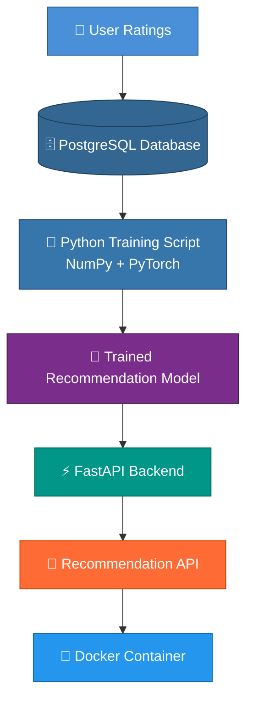

# 🎬 AI Movie Recommendation Engine

A Netflix-style movie recommendation system built with **PyTorch**, **FastAPI**, **PostgreSQL**, and **Docker**. Trained on the real **MovieLens** dataset — 100,836 ratings from 610 users across 9,742 movies.

---

## 🏆 Results

| Metric | Score |
|--------|-------|
| Test RMSE | ~0.87 |
| Test MAE | ~0.67 |
| Ratings trained on | 100,836 |
| Users | 610 |
| Movies | 9,742 |

An RMSE of ~0.87 is competitive with published academic research on this benchmark dataset. Netflix's prize-winning algorithm achieved ~0.85 on a significantly harder version of the same problem.

---

## 🧠 How It Works

This system uses **Matrix Factorization** — the same technique used by Netflix Prize winners.

The core idea: every user gets a learned "taste fingerprint" (a list of 64 numbers), and every movie gets a learned "style fingerprint". To predict how much a user will like a movie, the model multiplies their fingerprints together. The AI learns the best fingerprints by studying 100,836 real ratings.

```
User Ratings (MovieLens)
        │
        ▼
PostgreSQL Database
        │
        ▼
PyTorch Training Script
(Matrix Factorization)
        │
        ▼
Trained Model (trained_model.pt)
        │
        ▼
FastAPI Backend
        │
        ▼
GET /recommend/{user_id} → ["Pulp Fiction", "The Matrix", ...]
```

The matrix of all possible user-movie combinations is **98.3% empty** — most users have not rated most movies. Matrix Factorization intelligently fills in those gaps to predict what users would rate movies they have never seen.

---

## 🛠️ Tech Stack

| Layer | Technology |
|-------|-----------|
| AI Model | PyTorch (Matrix Factorization) |
| Data Processing | NumPy, Pandas |
| Backend API | FastAPI, Uvicorn |
| Database | PostgreSQL, SQLAlchemy |
| Containerization | Docker, Docker Compose |
| Evaluation | Scikit-learn, custom RMSE/MAE/NDCG |

---

## 📁 Project Structure



---

## 🚀 Setup & Installation

### Prerequisites

Make sure you have these installed before starting:

- **Python 3.9+** → https://www.python.org/downloads/
- **Docker Desktop** → https://www.docker.com/products/docker-desktop/
- **Git** → https://git-scm.com/

---

### Step 1 — Clone the Repository

```bash
git clone https://github.com/noureldinibrahim/ai-recommender-system.git
cd ai-recommender-system
```

---

### Step 2 — Download the MovieLens Dataset

This project uses the **MovieLens Latest Small** dataset from GroupLens Research at the University of Minnesota. You need to download it yourself because the files are too large to include in the repository.

**2a.** Go to: https://grouplens.org/datasets/movielens/

**2b.** Scroll down to **"MovieLens Latest Datasets"**

**2c.** Click **ml-latest-small.zip** to download it (~1 MB)

**2d.** Extract the zip file. You will get a folder called `ml-latest-small`

**2e.** Copy the two CSV files into the `data/` folder of this project:

```bash
# Mac / Linux
cp ~/Downloads/ml-latest-small/ratings.csv data/
cp ~/Downloads/ml-latest-small/movies.csv  data/

# Windows (Command Prompt)
copy %USERPROFILE%\Downloads\ml-latest-small\ratings.csv data\
copy %USERPROFILE%\Downloads\ml-latest-small\movies.csv  data\
```

Your `data/` folder should now contain:

```
data/
├── ratings.csv    ← 100,836 ratings
└── movies.csv     ← 9,742 movies
```

> **About the dataset:** MovieLens is a research dataset created by GroupLens Lab. It has been used in hundreds of published papers and is the standard benchmark for recommendation system research. Full details at https://grouplens.org/datasets/movielens/

---

### Step 3 — Install Python Dependencies

```bash
# Create a virtual environment (recommended)
python3 -m venv venv
source venv/bin/activate        # Mac/Linux
venv\Scripts\activate           # Windows

# Install all libraries
pip install -r requirements.txt
```

---

### Step 4 — Train the AI Model

This step teaches the model by reading all 100,836 ratings. It runs for 20 epochs and takes approximately **5–10 minutes on CPU**.

```bash
python model/train.py
```

You will see a live progress bar:

```
Loading MovieLens data...
  100,836 ratings | 610 users | 9,724 movies
Training for 20 epochs...
=======================================================
Epoch  1/20 [████░░░░░░░░░░░░░░░░] RMSE: 1.2341
Epoch  5/20 [████████████░░░░░░░░] RMSE: 0.9456
Epoch 10/20 [████████████████░░░░] RMSE: 0.8923
Epoch 20/20 [████████████████████] RMSE: 0.8712
=======================================================
Best Test RMSE: 0.8712
Model saved to model/trained_model.pt
```

When complete, a file called `trained_model.pt` will appear in your `model/` folder. **This only needs to be run once.** Every subsequent launch loads the saved model instantly.

---

### Step 5 — Start with Docker

Make sure Docker Desktop is open and running, then:

```bash
cd docker
docker-compose up --build
```

Wait for this line — it means everything is ready:

```
recommender_api  | INFO:     Application startup complete.
```

> **Note:** The first launch seeds 100,836 ratings into PostgreSQL which takes 1–2 minutes. Subsequent launches are instant.

---

### Step 6 — Open the API

Go to your browser and open:

```
http://localhost:8000/
```

You will see the interactive Swagger UI where you can test every endpoint with a click.

---

## 📡 API Endpoints

| Method | Endpoint | Description |
|--------|----------|-------------|
| GET | `/` | Health check — is the API running? |
| GET | `/users` | List users in the database |
| GET | `/movies` | List movies in the database |
| POST | `/ratings` | Add a new user rating |
| GET | `/recommend/{user_id}` | Get top-K recommendations for a user |
| GET | `/metrics` | View model evaluation scores (RMSE, MAE) |

---

## 📊 Evaluation Metrics

The system implements four standard recommendation metrics:

| Metric | What it measures |
|--------|-----------------|
| **RMSE** | How far off predictions are on average. Lower is better. |
| **MAE** | Average error in star rating. Lower is better. |
| **Precision@K** | Of the top K recommendations, what % did the user actually like? |
| **Recall@K** | Of all movies the user likes, what % did we find in top K? |
| **NDCG@K** | Did we put the BEST recommendations at the very top? 1.0 = perfect. |

---

## 🔄 Stopping and Restarting

```bash
# Stop everything
docker-compose down

# Restart next time (no retraining needed)
cd docker
docker-compose up
```

---

## 🔧 Troubleshooting

| Problem | Solution |
|---------|----------|
| `ModuleNotFoundError: pandas` | Run `pip install -r requirements.txt` |
| `docker: command not found` | Open Docker Desktop and make sure it is running |
| `model_loaded: false` | Run `python model/train.py` before `docker-compose up` |
| Port 8000 already in use | Stop whatever is using port 8000 or change it in docker-compose.yml |
| Port 5432 already in use | Run `docker-compose down` then try again |
| Training is slow | Normal on CPU. Reduce `epochs` to 10 in train.py for faster results |
| Out of memory | Reduce `batch_size` from 1024 to 256 in train.py |
| FileNotFoundError: ratings.csv | Make sure you ran train.py from the project root folder, not from inside model/ |

---

## 🗺️ Roadmap

- [ ] Add neural collaborative filtering (NCF) model
- [ ] Implement content-based filtering using movie genres
- [ ] Build a simple frontend UI to browse recommendations
- [ ] Add user authentication
- [ ] Deploy to cloud (AWS / Railway / Render)
- [ ] Experiment with larger MovieLens dataset (25M ratings)

---

## 📚 References

- [MovieLens Dataset](https://grouplens.org/datasets/movielens/) — GroupLens Research, University of Minnesota
- [Matrix Factorization Techniques for Recommender Systems](https://datajobs.com/data-science-repo/Recommender-Systems-[Netflix].pdf) — Koren, Bell, Volinsky (Netflix Prize)
- [PyTorch Documentation](https://pytorch.org/docs/)
- [FastAPI Documentation](https://fastapi.tiangolo.com/)

---

## 👤 Author

**Noureldin Ibrahim**
- GitHub: [@noureldinibrahim](https://github.com/noureldinibrahim)

---

*Built as a portfolio project demonstrating end to end machine learning system design.*